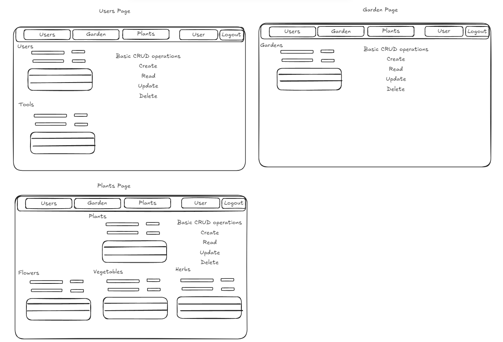
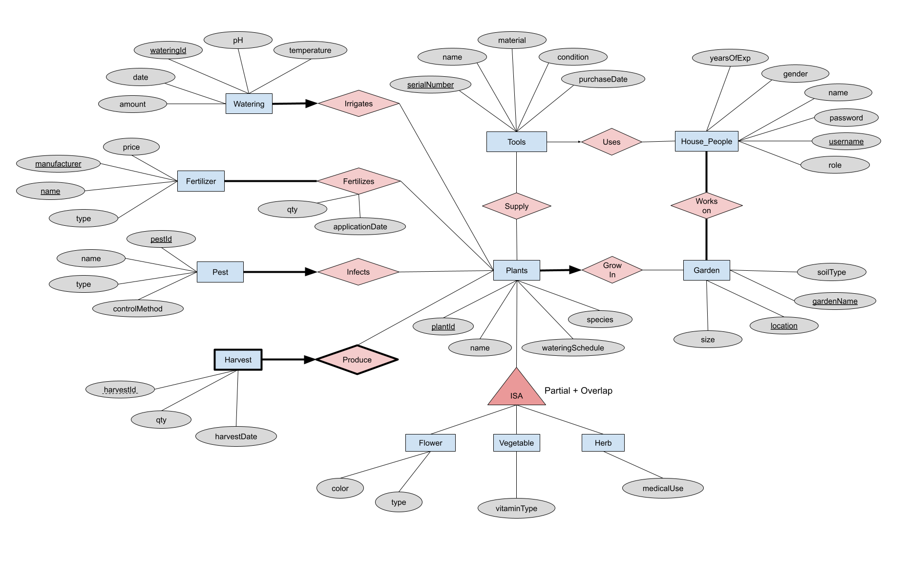

# CPSC 304 Garden App - Group 36

## Group Members
- Poppy Li (j2h7j)
- Jessie Zhou (u9j0p)
- Trevor Dang (v6l3p)

## Project Summary
Our project is a gardening app that provides users within a household the ability to maintain, manage, monitor, and harvest 
crops effectively and effectively by providing a centralized UI that displays garden and plant data. Additionally, our app
will provide users the ability to view and update data accordingly on the application.

## Timeline
- Create skeleton for front end (FE) [Jessie, Poppy]
- Modify back end (BE) template with basic functionality (displaying information from tables) from our database [Trevor]
- Populate FE with basic BE functionality [Trevor, Jessie, Poppy]
- Add more complicated BE functionality (more complex queries) [Trevor, Jessie, Poppy]
- If time permits: add styling to FE [Jessie, Poppy]

## Challenges/Things Left to do
- Set up garden app project with provided project template (from tutorial 2)
- Modify BE template with basic functionality
- Let BE server connect with DB
- Connect FE to BE server
- Everything else from timeline

## FE Drawing

## ER Diagram

